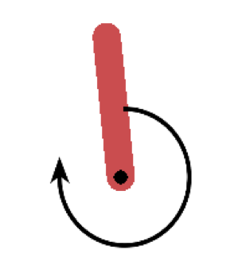
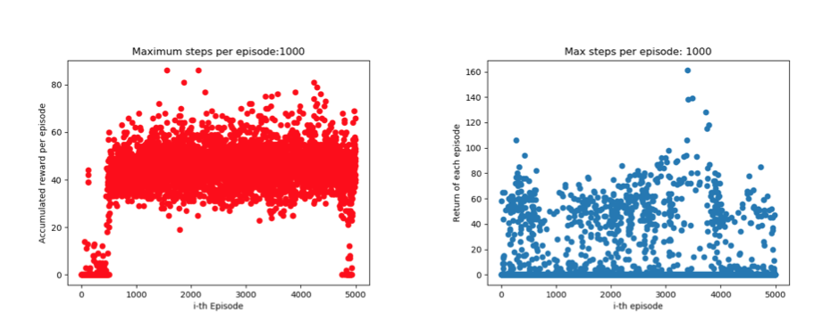
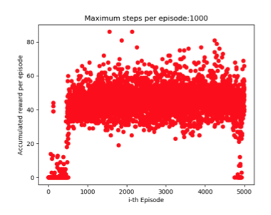

# Policy Gradient on modified Pendulum-v0

Apply REINFORCE and ACTOR-CRITIC algorithm on modified Pendulum-v0. 

The details about the environment modification can be found at `pendulum.py`.

## Optimisation

### 1.Trade off between episode length and number of episodes

### 2.Policy network hyperparameters: manual tuning

## Limitations

### Hyperparameter optimisation is expensive
* neural network has to wait till the end of each episode to update gradient

### Not enough exploration, does not converge
* Max torque is -2/2, max speed is -8/8
* Binary reward
* Only 5% of transitions contain useful information

## Improvement

### Hyperparameters Optimisation
* Expert Knowledge, AutoML

### Not enough exploration, does not converge
* Experience Replay
* Fixed Q target
* DDPG, A3C

